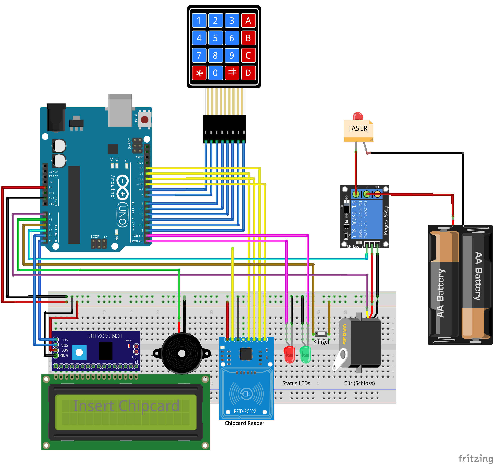

## SuperSecuritySystem v0.1
This security system aims to provide a reliable way to control the access to certain things only authorized persons are allowed to pass/open/etc.

Each authorized user has a 13.56MHz rfid chip card with a unique ID and a passcode. When both requirements are met, the lock opens.

